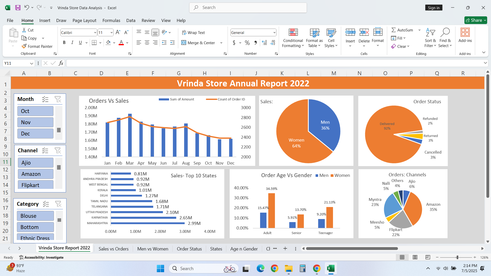
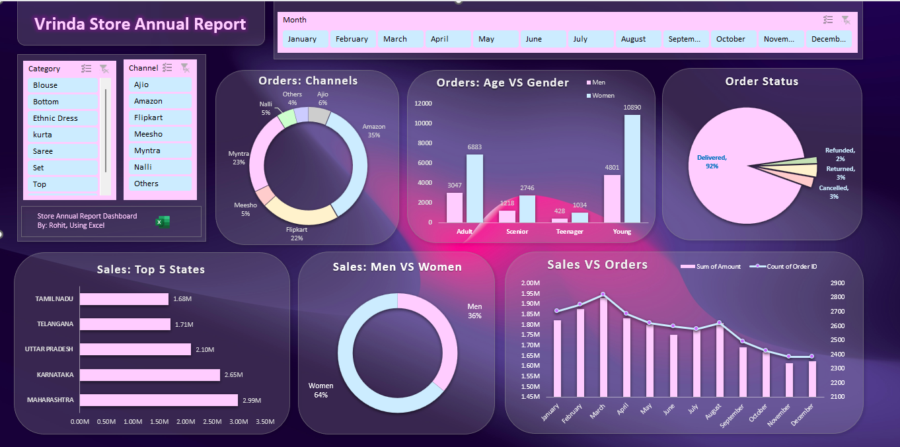

# 🛍️ Vrinda Store Sales Dashboard - 2022

This project showcases **two interactive Excel dashboards** designed to analyze the Vrinda Store’s sales and customer insights for the year 2022. Built using slicers, pivot tables, and dynamic visuals, the dashboards provide an intuitive breakdown of key performance indicators.

## 🎨 Dashboard Versions

### 🔸 Light Theme Dashboard
- Classic Excel visuals
- Clean and professional corporate layout
- Emphasis on readability and structure

### 🟣 Dark Theme Dashboard
- Aesthetic & modern design with gradients
- Enhanced visual engagement
- Ideal for presentation and reporting

## 📊 Dashboard Insights

- **Monthly Orders vs Sales**
- **Gender-based Sales Distribution**
- **Order Status Overview (Delivered, Returned, etc.)**
- **Top Performing States**
- **Orders by Channel (Amazon, Flipkart, etc.)**
- **Customer Age vs Gender Trends**
- **Category-wise Filters**

## 🖼️ Dashboard Previews

### 🔸 Light Theme

### 🟣 Dark Theme

## 🧰 Tools Used

- Microsoft Excel
- Pivot Tables & Charts
- Slicers & Filters
- Custom Chart Formatting

## 🚀 How to Use

1. Download the Excel files from the `data/` folder.
2. Open them using Microsoft Excel (2016 or later recommended).
3. Interact with slicers to dynamically view data by category, channel, or time.

## 🔮 Future Enhancements

- Integrate with Power BI for web dashboards.
- Automate monthly data feeds using Power Query.
- Create dashboards for multi-year comparison.

---

## 🤝 Connect With Me

- 🔗 [LinkedIn: Rohit Lakha](https://www.linkedin.com/in/rohit-lakha/)
- 📘 Project developed while learning at **Start**

---

**Made with 💡 by Rohit Lakha**

